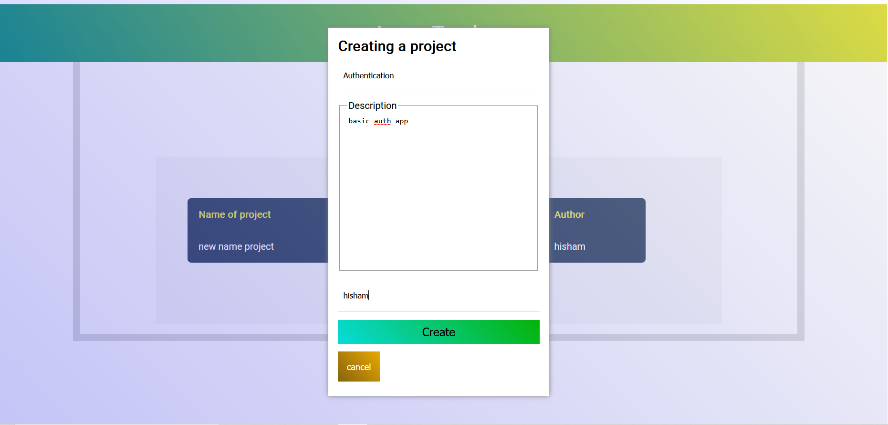

# Simple Issue Tracker

it is a basic replica of github issue tracker , creating project 
reporting issue regarding to that project

## Screenshots

    Create a project 

    Prohject page

    Create a issue

## Features

- Creation of project
- Repoting issue with multiple labels
- Project owner can filter out issues multiple label & much more
- Any user can create project and any is open to report an issue
- Issue reporter is notified with already attached label to the project

## Demo

https://basic-issue-tracker.herokuapp.com/

